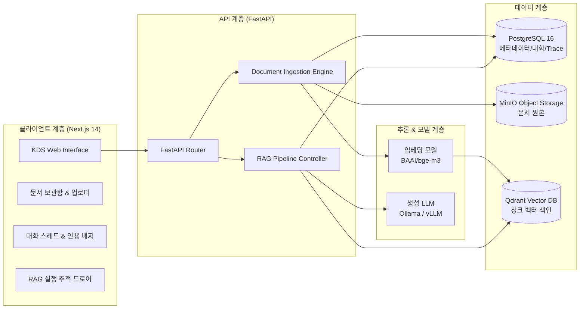

<div align="center">

# dograc

**문서 기반의 신뢰할 수 있는 엔터프라이즈 모듈형 RAG 플랫폼**

*Reading-First 미니멀 UI · 정확한 인라인 출처 인용 · 투명한 RAG 실행 추적(Trace) · 100% 로컬 온프레미스 지원*

<p align="center">
  
  
  
  
  
  
</p>

</div>

---

## 1. 개요 (Overview)

**`dograc`**는 사용자가 보유한 다양한 기술 문서, 매뉴얼, 사내 규정, 학술 논문(PDF 등)을 업로드하고, 문서의 근거를 기반으로 정확하게 질의응답할 수 있는 오픈소스 RAG(Retrieval-Augmented Generation) 시스템입니다.

단순히 질문과 문서를 상용 API에 던지는 챗봇을 넘어, **문서 파싱 → 청킹 → 벡터 임베딩 → 검색 → 답변 생성 → 인라인 출처 인용 → 파이프라인 진단(Trace)**에 이르는 전 과정을 개발자가 직접 제어하고 모니터링할 수 있도록 설계되었습니다.

---

## 2. 주요 특장점 (Key Features)

### 1) 정확한 인라인 근거 인용 (Grounded Inline Citations)
- AI 어시스턴트의 모든 답변은 참조한 실제 문서의 위치(`[파일명, p.페이지번호]`)를 인라인 배지 형태로 명시합니다.
- 문서에 없는 사실을 지어내는 환각(Hallucination)을 억제하며, 근거가 부족할 경우 정직하게 답변 불가를 안내합니다.

### 2) 투명한 RAG 파이프라인 분석기 (Transparent Execution Trace)
- 답변마다 **검색 및 실행 분석(Trace)** 드로어를 제공합니다.
- 벡터 검색에서 추출된 청크들의 **유사도 스코어**, **매칭 본문 미리보기**, **응답 지연시간(ms)**, **LLM에 실제 전달된 프롬프트 전문**을 투명하게 감사(Audit)할 수 있습니다.

### 3) Reading-First 미니멀 디자인 시스템 (KDS 기반)
- 교보 디자인 시스템(Kyobo Design System)의 시각 언어를 계승하여 장시간 텍스트 판독에 최적화된 차분한 UI를 제공합니다.
- 불필요한 이모지나 화려한 네온 그라데이션을 배제하고, **1px 정갈한 헤어라인**과 **지적인 Periwinkle Indigo (`#5055B1`) 액션 포인트**로 신뢰도 높은 업무 환경을 조성합니다.

### 4) 완벽한 데이터 주권 및 로컬 인프라 지원 (100% On-Premise Ready)
- 외부 클라우드로의 데이터 반출 없이 **Ollama(qwen2.5, llama3 등)** 및 **로컬 vLLM**, 오픈소스 임베딩 모델(`BAAI/bge-m3`)과 연동 가능합니다.
- PostgreSQL, Qdrant(Vector DB), MinIO(Object Storage)가 Docker Compose로 완벽히 오케스트레이션됩니다.

---

## 3. 시스템 아키텍처 (Architecture)



---

## 4. 기술 스택 (Tech Stack)

| 영역 | 기술 스택 | 설명 |
| :--- | :--- | :--- |
| **Frontend** | **Next.js 14 (App Router)**, React 18, TypeScript, Tailwind CSS, TanStack Query v5, Zustand, Lucide Icons | KDS 디자인 시스템 기반 고가독성 SPA |
| **Backend** | **Python 3.12**, **FastAPI**, SQLAlchemy 2.0 (Async), Alembic, Pydantic v2 | 비동기 고성능 RAG 백엔드 서버 |
| **Storage** | **PostgreSQL 16**, **Qdrant**, **MinIO (S3 Compatible)** | 워크스페이스 메타데이터, 벡터 인덱스, 문서 원본 보관 |
| **AI / RAG** | **Ollama** (`qwen2.5:7b`), **vLLM**, `BAAI/bge-m3`, PyMuPDF (PDF 파서) | 모듈형 임베딩 및 오픈소스 LLM 추론 |
| **Infra & Tooling** | **Docker & Docker Compose**, **uv** (Python 패키지 매니저), **pnpm** | 재현 가능한 격리형 로컬 개발 환경 |

---

## 5. 빠른 시작 (Quick Start)

### 사전 준비 사항
- [Docker Desktop](https://www.docker.com/) (가동 중)
- [Node.js](https://nodejs.org/) v20+ 및 [pnpm](https://pnpm.io/)
- [Python](https://www.python.org/) 3.12+ 및 [uv](https://docs.astral.sh/uv/)
- 로컬 LLM 구동 시: [Ollama](https://ollama.ai/) 설치 (`ollama pull qwen2.5:7b`)

---

### Step 1. 저장소 클론 및 환경 변수 설정
```bash
git clone https://github.com/minwoo1119/dograc.git
cd dograc

# 환경 변수 템플릿 복사 (.env 생성)
cp .env.example .env
```

### Step 2. 인프라 서비스 실행 (Postgres, Qdrant, MinIO)
```bash
docker compose -f infra/compose.yaml up -d
```
> 정상 실행 시 PostgreSQL (5432), Qdrant (6333), MinIO (9000, 콘솔 9001)가 백그라운드에서 구동됩니다.

### Step 3. 백엔드 API 실행
```bash
cd apps/api

# 가상환경 동기화 및 DB 마이그레이션
uv sync
uv run alembic upgrade head

# FastAPI 서버 구동
uv run uvicorn app.main:app --reload --host 0.0.0.0 --port 8000
```
- Swagger API 인터랙티브 문서: [`http://localhost:8000/docs`](http://localhost:8000/docs)

### Step 4. 프론트엔드 웹 UI 실행
새 터미널 창을 열고 아래 명령어를 실행합니다:
```bash
cd apps/web

# 의존성 설치 및 개발 서버 실행
pnpm install
pnpm dev
```
- 브라우저에서 [`http://localhost:3000`](http://localhost:3000) 접속

---

## 6. 사용 가이드 (How to Use)

1. **워크스페이스 생성**: 상단 바에서 '새 워크스페이스'를 생성하여 프로젝트나 주제별로 작업 영역을 분리합니다.
2. **문서 업로드**: 좌측 문서 패널의 점선 영역으로 PDF 파일을 드래그앤드롭합니다. 백엔드가 텍스트 파싱, 청킹 및 벡터 색인을 자동으로 처리합니다.
3. **질의응답**: 채팅창에 문서 관련 질문을 입력합니다.
4. **인용 및 Trace 확인**:
   - AI 답변 본문 속 `[파일명, p.숫자]` 인라인 배지를 통해 근거 문서를 확인합니다.
   - 답변 하단의 **'검색 및 실행 분석 보기'** 버튼을 클릭하여 슬라이드인 패널에서 매칭 청크 스코어 및 프롬프트 전문을 조회합니다.

---

## 7. 프로젝트 문서 (Documentation)

- [**AGENTS.md**](./AGENTS.md): 개발자 및 AI 에이전트를 위한 아키텍처 규칙, 코딩 컨벤션, 파인튜닝/평가 워크플로 및 상세 로드맵
- [**DESIGN.md**](./apps/web/DESIGN.md): 프론트엔드 UI/UX 디자인 시스템 명세서 (KDS 컬러 팔레트, 타이포그래피, 컴포넌트 규격)

---

## 8. 라이선스 (License)

본 프로젝트는 Apache License 2.0 하에 자유롭게 이용 및 수정할 수 있습니다.
자세한 내용은 [LICENSE](./LICENSE) 파일을 참고하세요.
