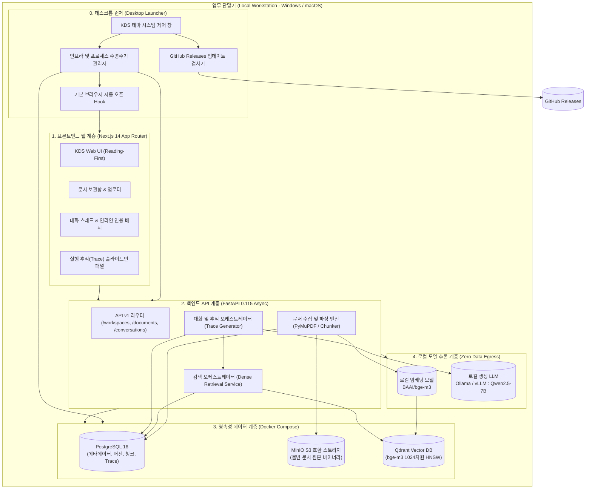

<div align="center">

# dograc

**사내 기밀 정보 보호를 위한 로컬 오픈소스 모델 기반 데스크톱-웹 하이브리드 RAG 플랫폼**

*원클릭 데스크톱 런처 · 100% 로컬 모델 자립 구동 · 투명한 실행 추적(Trace) · 정밀 인라인 근거 인용 · Reading-First KDS UI*

<p align="center">
  
  
  
  
  
  
  
  
</p>

</div>

---

## 1. 개요 (Overview)

**`dograc`**는 사내 규정, 계약서, 특허 명세서, 기술 문서 등 기업 내부의 비정형 지식 문서를 안전하게 질의응답하고 요약할 수 있는 **데스크톱-웹 하이브리드 RAG(Retrieval-Augmented Generation) 플랫폼**입니다.

OpenAI나 Anthropic 등 외부 상용 클라우드 API를 사용하는 기존 RAG 시스템은 사내 핵심 기밀이 외부 서버로 전송되는 심각한 데이터 유출 리스크를 안고 있습니다. `dograc`는 **외부 전송 데이터량 0 바이트(Zero Data Egress)**를 원칙으로 하여, 업무 단말기 내에 설치된 로컬 오픈소스 모델(Ollama / Qwen2.5, `BAAI/bge-m3`)과 오픈소스 스토리지(PostgreSQL, Qdrant, MinIO)만으로 완전 자립 구동됩니다.

Windows 및 macOS에서 **프로그램 실행(원클릭) 한 번으로 백그라운드 인프라가 가동되고 로컬호스트 웹 브라우저(`localhost:3000`)로 자동 연결**되며, 교보 디자인 시스템(KDS) 기반의 Reading-First UI, 투명한 실행 추적(Execution Trace), 정밀한 인라인 페이지 인용을 제공합니다.

---

## 2. 주요 특장점 (Key Features)

### 1) 원클릭 데스크톱-웹 하이브리드 실행

- Windows 탐색기(`dograc.bat`) 또는 macOS Finder(`dograc.command`)에서 더블클릭 한 번으로 실행됩니다.
- 복잡한 터미널 명령어나 가상환경 설정 없이, 데스크톱 런처가 Docker 인프라, 백엔드 API, 웹 UI, 로컬 모델 헬스체크를 순차 수행하고 기본 브라우저를 자동 호출합니다.
- 비개발자 사내 임직원도 즉시 업무에 활용할 수 있는 직관적인 데스크톱 창과 서비스 상태 표시등을 제공합니다.

### 2) 완전한 온프레미스 & 로컬 모델 자립 구동 (Zero Data Egress)

- 외부 상용 클라우드 API를 일절 호출하지 않아 추가 종량제 과금($0)이 없습니다.
- 로컬 GPU 기반의 **Ollama / vLLM (`qwen2.5:7b`)** 및 **`BAAI/bge-m3`** 온디바이스 임베딩을 활용합니다.
- 인터넷 연결이 차단된 폐쇄망 또는 단말기 독립(Workstation-Isolated) 환경에서도 데이터가 단말 외부로 단 1바이트도 유출되지 않습니다.

### 3) 투명한 RAG 실행 추적기 (Transparent Execution Trace)

- 검색과 생성을 단일 블랙박스 체인으로 묶지 않고 명시적으로 분리하여 오케스트레이션합니다.
- AI 답변마다 **'검색 및 실행 분석 보기'** 슬라이드인 패널(`TraceDrawer`)을 제공합니다.
- 검색 청크별 코사인 유사도 점수, 텍스트 미리보기, LLM에 실제로 주입된 프롬프트 전문, 순수 추론 지연 시간(ms)을 투명하게 감사(Audit)할 수 있습니다.

### 4) 정밀한 인라인 근거 인용과 정직한 거절 (Grounded Citations & Honest Refusal)

- AI 어시스턴트의 모든 답변은 참조한 실제 원본 문서의 위치(`[파일명, p.페이지번호]`)를 정규화하여 인라인 배지 형태로 렌더링합니다.
- 인라인 배지 클릭 시 원본 문서 청크와 즉시 대조할 수 있습니다.
- 사내 문서 문맥에 근거가 없는 질문의 경우 거짓 답변을 지어내지 않고 *"문서에서 관련 내용을 확인할 수 없습니다"*라고 정직하게 답변 불가를 안내합니다.

### 5) Reading-First 미니멀 디자인 시스템 (KDS 기반)

- 교보 디자인 시스템(Kyobo Design System)의 시각 언어를 계승하여 장시간 규정과 문서를 판독하는 데 최적화되었습니다.
- 시각적 잡음을 유발하는 이모지와 네온 그라데이션을 전면 배제하고, **1px 정갈한 헤어라인**과 차분한 **Periwinkle Indigo (`#5055B1`) 액션 포인트**를 적용했습니다.

### 6) Windows 설치 및 GitHub Releases 업데이트 확인

- PyInstaller 기반의 Standalone 패키징 및 Portable ZIP 배포를 지원합니다.
- 데스크톱 런처 상단에서 현재 버전(`v0.1.0`)을 표시하며, **[업데이트 확인]** 버튼을 통해 GitHub Releases의 최신 안정 버전을 비동기로 조회하고 다운로드 페이지로 연결합니다.

---

## 3. 시스템 아키텍처 (Architecture)


```mermaid
flowchart TD
    subgraph Workstation["업무 단말기 (Local Workstation - Windows / macOS)"]
        subgraph DesktopLauncher["0. 데스크톱 런처 (Desktop Launcher)"]
            LauncherUI["KDS 테마 시스템 제어 창"]
            ProcessMgr["인프라 및 프로세스 수명주기 관리자"]
            Updater["GitHub Releases 업데이트 검사기"]
            BrowserHook["기본 브라우저 자동 오픈 Hook"]
        end

        subgraph Presentation["1. 프론트엔드 웹 계층 (Next.js 14 App Router)"]
            UI["KDS Web UI (Reading-First)"]
            DocPanel["문서 보관함 & 업로더"]
            ChatPanel["대화 스레드 & 인라인 인용 배지"]
            TraceDrawer["실행 추적(Trace) 슬라이드인 패널"]
        end

        subgraph Backend["2. 백엔드 API 계층 (FastAPI 0.115 Async)"]
            Router["API v1 라우터 (/workspaces, /documents, /conversations)"]
            DocIngest["문서 수집 및 파싱 엔진 (PyMuPDF / Chunker)"]
            Retriever["검색 오케스트레이터 (Dense Retrieval Service)"]
            ConvService["대화 및 추적 오케스트레이터 (Trace Generator)"]
        end

        subgraph Storage["3. 영속성 데이터 계층 (Docker Compose)"]
            PG[("PostgreSQL 16\n(메타데이터, 버전, 청크, Trace)")]
            MinIO[("MinIO S3 호환 스토리지\n(불변 문서 원본 바이너리)")]
            VectorDB[("Qdrant Vector DB\n(bge-m3 1024차원 HNSW)")]
        end

        subgraph Models["4. 로컬 모델 추론 계층 (Zero Data Egress)"]
            Embed[("로컬 임베딩 모델\nBAAI/bge-m3")]
            LLM[("로컬 생성 LLM\nOllama / vLLM : Qwen2.5-7B")]
        end
    end

    GitHub[(GitHub Releases)]

    LauncherUI --> ProcessMgr
    LauncherUI --> Updater --> GitHub
    ProcessMgr --> Storage
    ProcessMgr --> Backend
    ProcessMgr --> BrowserHook --> Presentation

    Presentation --> Backend
    Backend --> Storage
    Backend --> Models
    DocIngest --> MinIO
    DocIngest --> Embed --> VectorDB
    DocIngest --> PG
    ConvService --> Retriever --> VectorDB
    Retriever --> PG
    ConvService --> LLM
    ConvService --> PG
```

- **관심사 분리**: 도메인 로직은 LangChain 등의 외부 라이브러리에 직접 의존하지 않고 Python `Protocol` 추상화 뒤에 배치됩니다.
- **이중 인가(Dual Authorization)**: Qdrant 벡터 검색 결과는 PostgreSQL에서 워크스페이스 소유권 및 문서 유효(`ready`) 상태를 관계형 조인으로 재검증하여 부서 간 데이터 누출을 원천 차단합니다.

---

## 4. 기술 스택 (Tech Stack)

| 영역 | 기술 스택 | 역할 |
| :--- | :--- | :--- |
| **Desktop Launcher** | **Python 3.12**, Tkinter, PyInstaller | Windows/macOS 원클릭 데스크톱 런처 및 서비스 수명주기 오케스트레이터 |
| **Frontend Web** | **Next.js 14 (App Router)**, React 18, TypeScript, Tailwind CSS, TanStack Query v5, Zustand, Lucide Icons | KDS 디자인 시스템 기반 Reading-First 고가독성 SPA |
| **Backend API** | **FastAPI 0.115**, SQLAlchemy 2.0 (Async), Alembic, Pydantic v2 | 비동기 고성능 RAG 백엔드 서버 및 트레이스 영속화 |
| **Storage** | **PostgreSQL 16**, **Qdrant**, **MinIO (S3 Compatible)** | 워크스페이스 메타데이터, 벡터 인덱스, 문서 원본 불변 보관 |
| **AI / RAG** | **Ollama** (`qwen2.5:7b`), **vLLM**, `BAAI/bge-m3`, PyMuPDF | 모듈형 로컬 임베딩 및 오픈소스 LLM 추론 |
| **Tooling & Test** | **Docker & Docker Compose**, **uv**, **pnpm**, **pytest** (56 passing) | 재현 가능한 격리형 로컬 개발 환경 및 자동화 테스트 |

---

## 5. 다운로드 및 업데이트 (Download & Update)

최신 데스크톱 실행본은 [GitHub Releases](https://github.com/minwoo1119/dograc/releases/latest)에서 받을 수 있습니다.

| 배포 파일 | 용도 |
| :--- | :--- |
| `dograc-win-Portable.zip` | 설치 없이 압축을 풀어 즉시 실행하는 Windows x64 휴대용 배포본 |
| `dograc.bat` | 소스 저장소 클론 후 Windows에서 즉시 더블클릭 실행하는 배치 런처 |
| `dograc.command` | 소스 저장소 클론 후 macOS Finder에서 즉시 더블클릭 실행하는 쉘 런처 |

설치된 앱에서는 데스크톱 런처 상단의 **[업데이트 확인]** 버튼을 클릭하면 GitHub Releases의 최신 버전을 확인합니다. 새 버전이 있으면 릴리스 노트 요약과 함께 다운로드 페이지로 안전하게 안내합니다.

---

## 6. 빌드 및 실행 (Build & Run)

### 사전 준비 사항

- [Docker Desktop](https://www.docker.com/) (가동 중)
- [Python](https://www.python.org/) 3.12+ 및 [uv](https://docs.astral.sh/uv/)
- [Node.js](https://nodejs.org/) v20+ 및 [pnpm](https://pnpm.io/)
- 로컬 LLM 구동 시: [Ollama](https://ollama.ai/) 설치 (`ollama pull qwen2.5:7b`)

---

### Step 1. 저장소 클론

```bash
git clone https://github.com/minwoo1119/dograc.git
cd dograc
```

### Step 2. 원클릭 데스크톱 런처 실행 (권장)

터미널 명령어 없이 한 번의 더블클릭으로 모든 백그라운드 서비스를 띄우고 브라우저를 자동 오픈합니다:

- **Windows**: 루트 디렉터리의 [`dograc.bat`](./dograc.bat) 더블클릭
- **macOS**: 루트 디렉터리의 [`dograc.command`](./dograc.command) 더블클릭
- **파이썬 직접 실행**: `python run_launcher.py` (또는 터미널 전용: `python run_launcher.py --cli`)

### Step 3. 개발자 수동 실행 (Manual CLI)

수동으로 각 서비스를 개별 제어하고자 할 경우:

```bash
# 1. 환경 변수 설정 및 인프라 실행
cp .env.example .env
docker compose -f infra/compose.yaml up -d

# 2. 백엔드 API 실행 (FastAPI)
cd apps/api
uv sync
uv run alembic upgrade head
uv run uvicorn app.main:app --reload --host 0.0.0.0 --port 8000

# 3. 프론트엔드 웹 UI 실행 (새 터미널)
cd apps/web
pnpm install
pnpm dev
```
- 브라우저에서 [`http://localhost:3000`](http://localhost:3000) 접속
- Swagger API 인터랙티브 문서: [`http://localhost:8000/docs`](http://localhost:8000/docs)

### Step 4. 자동화 테스트 실행

```bash
# 백엔드 테스트 (56개 테스트 전체 통과 필수)
cd apps/api
uv run pytest

# 프론트엔드 빌드 검증 (타입 오류 0건 유지)
cd apps/web
npx pnpm build
```

---

## 7. 사용 가이드 (How to Use)

1. **데스크톱 런처 시작**: `dograc.bat` 또는 `dograc.command`를 실행하고 **[원클릭 서비스 시작]**을 클릭합니다. 브라우저가 자동 실행됩니다.
2. **워크스페이스 생성**: 상단 바에서 '새 워크스페이스'를 생성하여 부서, 프로젝트 또는 주제별로 격리 영역을 생성합니다.
3. **사내 문서 업로드**: 좌측 문서 패널로 사내 PDF 문서를 드래그앤드롭합니다. 텍스트 추출, 재귀적 청킹, BGE-M3 벡터 색인이 자동 완료됩니다.
4. **질의응답**: 채팅창에 사내 규정이나 기술 문서에 대한 질문을 입력합니다.
5. **인라인 인용 확인**: 답변 본문 속 `[파일명, p.숫자]` 인라인 배지를 통해 정확한 근거 페이지를 확인합니다.
6. **실행 추적 감사**: 답변 하단의 **'검색 및 실행 분석 보기'** 버튼을 클릭하여 슬라이드인 패널에서 매칭 청크 점수, 원본 프롬프트, LLM 추론 지연 시간을 조회합니다.

---

## 8. 모델 교체 및 커스텀 모델 설정 (Custom Models)

`dograc`는 Protocol 추상화 인터페이스를 채택하여 소스코드 수정 없이 설정(`.env`)만으로 모델을 유연하게 교체할 수 있습니다.

```dotenv
# .env 설정 예시
# 임베딩 모델 (HuggingFace 로컬 캐시)
EMBEDDING_MODEL_NAME=BAAI/bge-m3

# 로컬 LLM 생성 공급자 (Ollama 또는 vLLM)
OLLAMA_BASE_URL=http://localhost:11434
GENERATION_MODEL_NAME=qwen2.5:7b
```

Ollama에서 다른 오픈소스 모델을 사용할 경우:
```bash
ollama pull llama3.1:8b
# .env에서 GENERATION_MODEL_NAME=llama3.1:8b 로 변경
```

---

## 9. 결과물과 프로젝트 구조 (Outputs & Project Structure)

데스크톱 패키징 명령(`python scripts/build_desktop.py`)을 실행하면 다음 결과물이 생성됩니다:

```text
artifacts/
└─ releases/
   └─ dograc-win-Portable.zip  # Windows x64 휴대용 배포본
dist/
└─ dograc-launcher/            # Standalone 실행 디렉터리
```

소스 저장소 구조는 다음과 같습니다:

```text
dograc/
├─ launcher/                     # 데스크톱-웹 하이브리드 런처 패키지
│  ├─ gui.py                     # Tkinter 기반 KDS 테마 데스크톱 창
│  ├─ services.py                # Docker, API, Web, Ollama 프로세스 수명주기 관리자
│  ├─ updater.py                 # GitHub Releases 업데이트 확인 서비스
│  └─ version.py                 # 버전 명세 (v0.1.0)
├─ apps/
│  ├─ web/                       # Next.js 14 App Router 기반 SPA 프론트엔드 (KDS 준수)
│  │  ├─ DESIGN.md               # UI/UX 디자인 사양서 (Reading-First, KDS 기반)
│  │  ├─ src/app/                # 라우트 및 레이아웃
│  │  └─ src/components/         # Navbar, DocumentPanel, ChatPanel, TraceDrawer 등
│  └─ api/                       # FastAPI 비동기 백엔드
│     ├─ app/api/v1/             # 엔드포인트 라우터 (workspaces, documents, traces)
│     ├─ app/models/             # 추상화 프로토콜 (Embedding, Generation)
│     ├─ app/retrieval/          # Dense 검색 및 RDBMS 이중 인가 필터링
│     ├─ app/document_processing/# PDF 파싱 및 재귀적 청킹 엔진
│     └─ tests/                  # pytest 단위 및 통합 테스트 모음 (56 passed)
├─ scripts/
│  └─ build_desktop.py           # PyInstaller 데스크톱 패키징 스크립트
├─ infra/
│  └─ compose.yaml               # PostgreSQL, Qdrant, MinIO 오케스트레이션
├─ .github/
│  └─ workflows/desktop-release.yml # GitHub Actions 자동 릴리스 워크플로
├─ AGENTS.md                     # 개발자 및 에이전트 지침서
├─ dograc.bat                    # Windows 원클릭 실행 배치 스크립트
├─ dograc.command                # macOS 원클릭 실행 쉘 스크립트
├─ run_launcher.py               # 파이썬 실행 진입점
└─ README.md                     # 본 문서
```

---

## 10. 릴리스 방법 (Release)

릴리스 워크플로는 `v*.*.*` 형식의 태그가 push될 때 자동으로 실행됩니다.

```bash
git tag -a v0.1.0 -m "Release v0.1.0"
git push origin v0.1.0
```

GitHub Actions는 다음 작업을 순서대로 수행합니다:
1. Python 3.12 환경에서 전체 백엔드 테스트(pytest 56건)를 실행합니다.
2. Node.js 20 환경에서 프론트엔드 웹 UI를 프로덕션 빌드합니다.
3. PyInstaller로 데스크톱 런처를 번들링하고 `dograc-win-Portable.zip`을 생성합니다.
4. 태그에 대응하는 GitHub Release를 생성하고 생성물을 자동으로 업로드합니다.

로컬에서 동일한 패키징을 수동으로 수행하려면 다음 명령을 사용합니다:
```bash
python scripts/build_desktop.py
```

---

## 11. 프로젝트 문서 (Documentation)

- [**AGENTS.md**](./AGENTS.md): 개발자 및 AI 에이전트를 위한 아키텍처 규칙, 코딩 컨벤션, 파인튜닝/평가 워크플로 및 상세 로드맵
- [**DESIGN.md**](./apps/web/DESIGN.md): 프론트엔드 UI/UX 디자인 시스템 명세서 (KDS 컬러 팔레트, 타이포그래피, 컴포넌트 규격)

---

## 12. 개발 원칙 (Development Principles)

- **검색과 생성의 명시적 분리**: RAG 파이프라인의 검색 단계와 생성 단계는 불투명한 체인으로 은닉되지 않으며, 모든 입출력과 점수는 `Trace` 레코드로 영속화됩니다.
- **도메인 계층의 프레임워크 독립성**: LangChain 등 특정 프레임워크 객체가 비즈니스 로직에 침투하지 않도록 Protocol 추상화 뒤에 배치합니다.
- **철저한 데이터 격리**: 모든 쿼리와 스토리지는 워크스페이스 단위로 격리되며, 외부 API로 사내 데이터가 절대 전송되지 않습니다.
- **신뢰 기반 인라인 인용**: 답변은 항상 `[파일명, p.숫자]` 근거를 명시하며, 문맥 부재 시 정직하게 답변 불가를 선언합니다.
- **테스트 통과 의무**: 백엔드 테스트 100% 통과 및 프론트엔드 타입 오류 0건을 항상 유지합니다.

---

## 13. 라이선스 (License)

본 프로젝트는 [Apache License 2.0](./LICENSE) 하에 자유롭게 이용 및 수정할 수 있습니다. 자세한 내용은 `LICENSE` 파일을 참고하세요.
